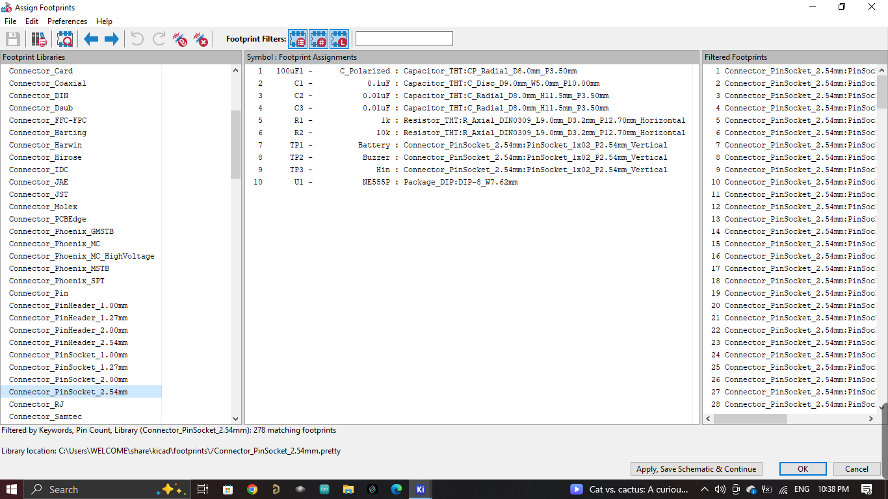

# Touch-Activated Calling Bell PCB | NE555 Timer

A 2-layer KiCad PCB design for a touch-activated calling bell using the NE555 timer IC. The project covers schematic capture, component placement, PCB routing, ERC/DRC verification, 3D visualization, and Gerber generation for fabrication.

## Project Overview

The circuit detects a touch input and uses the NE555 timer to generate an output signal that drives a buzzer. The PCB provides dedicated connections for battery power, touch input, and buzzer output.

## Circuit Operation

- **TP1** provides the battery/power input.
- **TP3** is the touch-input connection.
- The touch signal triggers the **NE555P** timer circuit.
- The timer output is connected to **TP2** for the buzzer.
- Capacitors provide timing, filtering, and supply/control-pin decoupling.

## PCB Design Workflow

1. Schematic capture in KiCad.
2. Component and footprint assignment.
3. PCB component placement.
4. Track routing and board layout.
5. Electrical Rules Check (ERC).
6. Design Rules Check (DRC).
7. 3D PCB visualization.
8. Gerber file generation for fabrication.

## Main Components

| Reference | Component | Value / Part |
|---|---|---|
| U1 | Timer IC | NE555P |
| R1 | Resistor | 1 kΩ |
| R2 | Resistor | 10 kΩ |
| C1 | Capacitor | 0.1 µF |
| C2 | Capacitor | 0.01 µF / 10 nF |
| C3 | Capacitor | 0.01 µF / 10 nF |
| C4 | Capacitor | 100 µF |
| TP1 | Connector | Battery input |
| TP2 | Connector | Buzzer output |
| TP3 | Connector | Touch input |

## Design Images

### Circuit Schematic

Complete circuit schematic of the touch-activated calling bell, showing the NE555P timer, touch-input section, power supply, and buzzer output.


### PCB Layout

Final two-layer PCB layout showing component footprints, copper tracks, pads, board outline, and routing.


### Component Footprints

PCB footprint view showing the physical footprints assigned to the components before final routing.



### 3D PCB View

Three-dimensional view of the designed PCB showing component placement and the overall physical board arrangement.


### Gerber File Visualization

Generated Gerber layer visualization used to verify the PCB manufacturing data.


### Gerber Layer View

Additional Gerber visualization showing the PCB manufacturing layers and their alignment.


## Design Considerations

- Designed as a compact 2-layer PCB.
- Used dedicated connectors for battery, touch input, and buzzer output.
- Included supply decoupling to improve circuit stability.
- Included a 10 nF bypass capacitor on the NE555 control-voltage pin for improved noise immunity.
- Component placement and routing were arranged to keep the PCB layout clean and practical.

## Tools Used

- **KiCad Schematic Editor** – circuit schematic design
- **KiCad PCB Editor** – component placement and routing
- **KiCad 3D Viewer** – PCB visualization
- **KiCad Gerber Viewer** – fabrication-output verification
- **KiCad Footprint Assignment** – footprint selection and assignment

## Repository Structure

```text
Touch-Activated-Calling-Bell-PCB/
├── README.md
├── images/
├── schematic/
├── pcb/
└── gerber/
```

## Applications

This project demonstrates practical PCB design skills for an embedded/electronics application, including schematic design, PCB layout, design-rule verification, and manufacturing-file preparation.

## Author

**Parthiv S N**

GitHub: [Parthiv3sn](https://github.com/Parthiv3sn)
